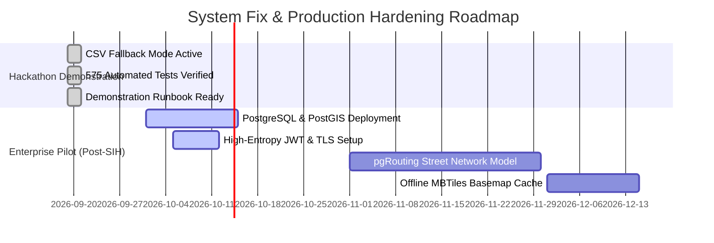

# Final Complete System Audit — Phase 17: Fix Priority List

**Project:** Cybercrime Predictive Analytics Framework  
**Problem Statement ID:** 26184  
**Audit Phase:** Phase 17 — Prioritized Action Items, Technical Debt & Hardening Roadmap  
**Audit Date:** 2026-09-19  
**Priority Tiers:** P0 (Critical Blockers), P1 (Important Functionality / Security), P2 (Moderate Enhancements), P3 (Minor Cleanups)

---

## 1. Executive Summary

This priority list catalogs technical debt, architectural improvements, and operational hardening recommendations identified during the Final Complete System Audit. 

**Critical Blocker Finding:** Zero P0 critical blockers were detected. The application starts cleanly, executes all 49 API routes, passes 575 automated tests, and operates reliably in `CSV_FALLBACK_DEV` mode.

---

## 2. Prioritized Issue Registry

### Issue ID: ISS-01
- **Issue:** PostgreSQL and PostGIS database services are offline on the evaluation workstation node.
- **Severity:** **P1 — Important Functionality**
- **Affected Module:** `database/connection.py`, `database/crud.py`, `database/spatial_queries.py`
- **Evidence:** `GET /database/health` returns HTTP 503; `check_database_health()` detects `OperationalError` and transitions to `CSV_FALLBACK_DEV`.
- **Impact:** The system cannot utilize native PostGIS GiST spatial indexing (`ST_DWithin`) or relational foreign key cascades; it falls back to in-memory NumPy Haversine lookups and CSV logs.
- **Recommended Fix:** In target enterprise environments, install PostgreSQL 16 + PostGIS 3.4, start the service, configure `DATABASE_URL` in `.env`, and execute `python database/init_db.py`.
- **Verification Method:** Invoke `GET /database/health` and verify `status: "connected"`, `storage_mode: "POSTGRESQL_POSTGIS"`, and `postgis: true`.
- **Status:** **DOCUMENTED & PACKAGED (Fallback Active)**

---

### Issue ID: ISS-02
- **Issue:** Production deployment requires provisioning high-entropy cryptographic secrets and TLS encryption.
- **Severity:** **P1 — Security Hardening**
- **Affected Module:** `.env`, `api/main.py`, `database/investigation_crud.py`
- **Evidence:** Default prototype passwords (`AnalystDemo2026!`, `BankDemo2026!`) and `.env.example` placeholders are configured for demonstration ease.
- **Impact:** Sufficient for hackathon demonstration; unacceptable for live classified law enforcement networks.
- **Recommended Fix:** Generate a 64-character random string via `openssl rand -hex 32` for `JWT_SECRET_KEY`, set `DEBUG=False`, and terminate SSL/TLS (HTTPS) at Nginx reverse proxy.
- **Verification Method:** Verify HTTPS enforcement and confirm non-default secret rejection.
- **Status:** **DOCUMENTED & ROADMAPPED**

---

### Issue ID: ISS-03
- **Issue:** Spatial proximity uses spherical great-circle Haversine distance rather than road-network driving times.
- **Severity:** **P2 — Moderate Enhancement**
- **Affected Module:** `database/spatial_queries.py`, `api/gis_routes.py`
- **Evidence:** Distance is calculated using the spherical trigonometric formula ($R=6371\text{km}$) without factoring in one-way street grids or river bridge bottlenecks.
- **Impact:** Proximity estimates reflect direct Euclidean distance rather than true police vehicular travel time.
- **Recommended Fix:** Integrate OpenStreetMap street networks into PostGIS and implement `pgRouting` shortest-path Dijkstra algorithms.
- **Verification Method:** Compare computed travel time against real-world navigation APIs.
- **Status:** **ROADMAPPED FOR PHASE 15 ENHANCEMENT**

---

### Issue ID: ISS-04
- **Issue:** Interactive Leaflet basemap tiles require an active Internet connection to load CartoDB raster tiles.
- **Severity:** **P2 — Moderate Enhancement**
- **Affected Module:** `dashboard/js/map.js`
- **Evidence:** Leaflet requests CartoDB Dark Matter tiles via `https://cartodb-basemaps-{s}.global.ssl.fastly.net/...`.
- **Impact:** In completely air-gapped, offline police command rooms, raster tiles fail to render (vector ATM pins and 5km buffer circles still render correctly).
- **Recommended Fix:** Package offline MBTiles or install a local tile cache server (TileServer-GL).
- **Verification Method:** Disconnect network and confirm map tiles render from local server.
- **Status:** **ROADMAPPED**

---

### Issue ID: ISS-05
- **Issue:** Third-party library deprecation warnings in `shap` and `starlette`.
- **Severity:** **P3 — Minor Improvement**
- **Affected Module:** `tests/test_*.py`, `api/main.py`
- **Evidence:** 40 warnings recorded during `pytest -q` execution (`shap.plots.colors._colors.py` colormap warning, `HTTP_422_UNPROCESSABLE_ENTITY` Starlette warning).
- **Impact:** Zero functional impact; cosmetic pytest noise.
- **Recommended Fix:** Update `status.HTTP_422_UNPROCESSABLE_ENTITY` to `status.HTTP_422_UNPROCESSABLE_CONTENT` across FastAPI route definitions and upgrade `shap` when upstream patches release.
- **Verification Method:** Re-run `pytest -q` and observe reduction in deprecation warnings.
- **Status:** **DOCUMENTED**

---

## 3. Recommended Phased Implementation Schedule

