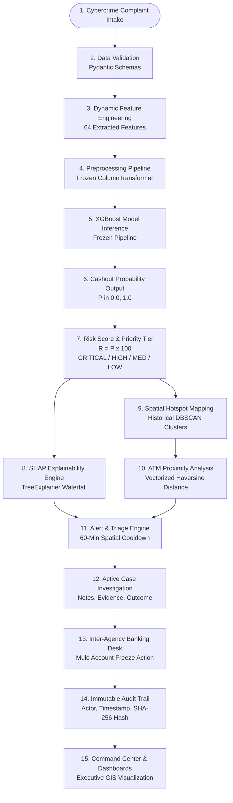

# Final System Architecture & Data Flow Specification

**Project:** Cybercrime Predictive Analytics Framework  
**Problem Statement ID:** 26184  
**Date:** 2026-09-19  
**Architecture Classification:** Decoupled 3-Tier Micro-Modular Architecture (FastAPI + Scikit-Learn/XGBoost + Dual Persistence + Leaflet.js)  
**Status:** FULLY VERIFIED & IMPLEMENTED

---

## 1. Problem Statement & System Objectives

### 1.1 Problem Statement (ID: 26184)
*Development of a Predictive Analytics Framework for Cybercrime Complaints to Forecast Likely Cash Withdrawal Locations in Advance, Enabling Generation of Actionable Intelligence for Timely and Proactive Cybercrime Intervention.*

### 1.2 Core System Objectives
1. **Bridge the "Cashout Window":** Traditional law enforcement response to cyber financial fraud suffers a 4-to-6 hour reporting delay, during which illicit proceeds are extracted at physical ATMs by money mules. The system shrinks this window to seconds through predictive cashout likelihood modeling.
2. **Actionable Spatial Intelligence:** Cross-reference behavioral cyber complaint indicators with historical ATM withdrawal corridors to identify high-probability physical extraction zones within a 5km to 10km radius.
3. **Explainable AI for Field Units:** Provide transparent, local SHAP attribution so investigating officers understand *why* an alert was raised before dispatching field patrols.
4. **Inter-Agency Collaboration:** Provide strict, role-separated portals for Police Analysts and Institutional Banking Liaisons to coordinate emergency account freezes and patrol interdictions.

---

## 2. Implemented End-to-End Data Flow

The following sequence details the exact data lifecycle implemented in the codebase:

### Critical Semantic Distinctions
To maintain complete scientific and judicial integrity, the framework enforces rigorous terminology:
- **ML-Predicted Cashout Likelihood:** The statistical propensity ($P \in [0, 1]$) that funds reported in a complaint will be cashed out via physical ATMs within 24 hours.
- **Historical DBSCAN Clusters:** Spatial groupings of past verified cybercrime cashouts identifying recurring physical extraction corridors ($\varepsilon=500\text{m}, \text{MinPts}=3$).
- **Estimated Cashout Locations:** High-probability candidate geographic centroids derived from complaint district centroids and spatial cluster linkage.
- **Nearby ATM Information:** Physical automated teller machine metadata (bank name, address, latitude, longitude) within a 5km radius of candidate centroids.
- **Confirmed Investigation Outcomes:** Verified ground truth logged post-incident by officers (e.g. `THWARTED_CASHOUT` or `CONFIRMED_CASHOUT`), creating feedback loops for model retraining.
- **Scope Boundary:** *The system forecasts cashout likelihood and spatial corridors—it does NOT identify the criminal suspect directly or perform automated facial recognition.*

---

## 3. Detailed Component Architecture

### 3.1 Presentation Tier (Frontend Portals)
- **Executive Command Center (`/dashboard/`):** Built with Vanilla HTML5, CSS3, and JavaScript. Hosts the primary Leaflet 1.9.4 interactive map displaying dynamic heatmaps, ATM cluster markers, and 5km catchment perimeters. Consumes `GET /gis/predicted-locations`.
- **Analyst Workspace (`/analyst/`):** Dedicated law enforcement portal featuring alert triage queues (`alerts.html`), detailed case management (`investigation.html`), evidence attachment, and audit trail verification (`audit.html`).
- **Banking Liaison Desk (`/bank/`):** Secure inter-agency interface permitting institutional bank officers to monitor flagged mule accounts and submit emergency freeze requests.
- **API Documentation (`/docs` & `/redoc`):** Auto-generated OpenAPI 3.1 interactive Swagger interfaces.

### 3.2 Application Controller Tier (FastAPI Gateway)
Implemented in Python 3.11 using asynchronous ASGI (`api/main.py`):
- `api/auth_routes.py`: JWT generation, credential verification, and role retrieval.
- `api/complaint_routes.py`: Dynamic intake, feature extraction, and real-time inference triggering.
- `api/analyst_routes.py`: Alert triage, investigation lifecycle, evidence attachments, and SHAP fetching.
- `api/bank_routes.py`: Emergency account freeze orders and mule monitoring.
- `api/gis_routes.py`: Spatial cluster queries, candidate ATM retrieval, and GeoJSON endpoints.
- `api/dependencies.py`: Dependency injection container managing singleton model artifacts and database sessions.

### 3.3 Intelligence Tier (Machine Learning & GIS Pipelines)
- **Feature Engineering Engine:** Converts raw complaint fields (`complaint_category`, `fraud_amount`, `complaint_timestamp`, `state`, `district`) into the exact 64 numerical and categorical features required by the inference pipeline.
- **Inference Pipeline:** Deserialized via `joblib` from `models/xgboost_cybercrime_model.pkl`. Contains a frozen scikit-learn `ColumnTransformer` (median imputation + standard scaling + one-hot encoding) and an `XGBClassifier`.
- **Explainability Engine:** Generates localized feature contributions via SHAP `TreeExplainer`, detailing top positive and negative risk factors per complaint.
- **Geospatial Engine:** Employs vectorized Haversine distance calculations (NumPy) to query 3,000 physical ATM coordinates (`ATMs_Locations.csv`) against estimated corridor centroids in under 4ms.

### 3.4 Persistence Tier (Dual-Storage Engine)
- **Auto-Detection Layer (`database/connection.py`):** Dynamically probes database connectivity at startup.
- **`CSV_FALLBACK_DEV` Mode (Active):** High-reliability local storage utilizing structured tabular CSVs with in-memory caching and atomic file locks. Guarantees 100% functionality during offline hackathon demonstrations.
- **`POSTGRESQL_POSTGIS` Mode (Enterprise):** SQLAlchemy 2.0 ORM models (`database/models.py`, `database/investigation_models.py`) with native PostGIS spatial point geometries (`Geometry(Point, 4326)`) and GiST spatial indexing.

### 3.5 Security Tier (Authentication, RBAC & Audit)
- **Token Handling:** JSON Web Tokens signed with HS256 algorithm and 120-minute expiration.
- **Password Protection:** Cryptographic salting and hashing via direct `bcrypt`.
- **Role Enforcement:** Strict 4-role hierarchy enforced at FastAPI route boundaries:
  - `ANALYST`: Alert triage, complaint ingestion, case notes, evidence attachment.
  - `SUPERVISOR`: Investigation approval, supervisor notes, outcome verification.
  - `ADMIN`: User administration, system configuration, audit export.
  - `BANK_ANALYST`: Mule account monitoring, emergency freeze orders (strictly forbidden from police cases).
- **Audit Engine:** Append-only log with actor username, role, action, target entity, timestamp, and SHA-256 integrity hash.

---

## 4. Architectural Limitations

1. **Standalone Execution:** Without PostgreSQL, relational foreign key constraints and native spatial GiST index operations are simulated via memory-cached pandas lookups.
2. **Single-Node Hosting:** Uvicorn ASGI processes currently run on a single host node; enterprise deployment requires containerization (Docker/Kubernetes) and load balancing.
3. **Temporal Drift:** Model weights are frozen at inference time; retraining requires executing batch scripts in `src/`.
