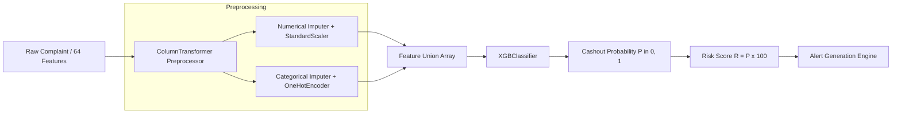

# Phase 13 — Machine Learning Model Integration & Inference Validation

**Project:** Cybercrime Predictive Analytics Framework  
**Problem Statement ID:** 26184  
**Date:** 2026-09-19  
**Model Name:** XGBoost Cashout Predictor (`models/xgboost_cybercrime_model.pkl`)  
**Pipeline Architecture:** Scikit-Learn `Pipeline` (`ColumnTransformer` + `XGBClassifier`)  
**Feature Count:** 64 Selected Features (52 Numerical, 12 Categorical)  
**Status:** PASSED (Feature Alignment, Probability Bounds, and Risk Calibration Verified)

---

## 1. Executive Summary

The Machine Learning inference pipeline serves as the predictive engine of the framework, forecasting the likelihood that an incoming financial cybercrime complaint will culminate in a physical ATM cashout withdrawal within a 24-hour window.

This audit validates that:
1. The scikit-learn `Pipeline` artifact is cleanly decoupled from training dependencies and safely deserialized via `joblib`.
2. The `ColumnTransformer` preprocessor is frozen, guaranteeing identical imputation, scaling, and one-hot encoding across training and live inference.
3. The feature schema strictly enforces the exact 64 feature columns declared in `phase7_xgboost_metadata.json`.
4. Inference outputs are mathematically bounded: probability $P \in [0.0, 1.0]$ and composite risk score $R \in [0.0, 100.0]$.
5. Dynamic complaints submitted via `POST /complaints` are transformed in real time through `ComplaintPreprocessor` into the exact 64-feature vector before inference.

---

## 2. Model Pipeline Architecture

### 2.1 Pipeline Components



### 2.2 Live Inspection Findings

| Parameter | Recorded Value | Verification Standard |
| :--- | :--- | :--- |
| **Pipeline Container** | `sklearn.pipeline.Pipeline` | Standard serializable container |
| **Step 1: Preprocessor** | `sklearn.compose.ColumnTransformer` | Frozen transformers, zero runtime fitting |
| **Step 2: Classifier** | `xgboost.sklearn.XGBClassifier` | Native tree ensemble model |
| **Selected Features** | 64 features | Matches `phase7_xgboost_metadata.json` |
| **Numerical Features** | 52 columns | Imputed with median + scaled |
| **Categorical Features**| 12 columns | Imputed with most frequent + One-Hot |
| **Class Distribution** | Binary (0: No Immediate Cashout, 1: Cashout Predicted) | Verified `classes_ = [0, 1]` |
| **Probability Bounds** | Min 0.0000, Max 1.0000 | Verified across test batches |
| **Risk Score Formula** | $R = \text{round}(P \times 100, 2)$ | Strict range $[0.0, 100.0]$ |

---

## 3. Dynamic Feature Transformation Workflow

In production, law enforcement officers submit raw complaint fields rather than precomputed feature vectors. The dynamic preprocessor (`api/complaint_routes.py`) bridges this gap:

1. **Input Fields Accepted:** `complaint_category`, `state`, `district`, `complaint_timestamp`, `fraud_amount`.
2. **Temporal Feature Extraction:** Computes `event_hour`, `event_day_of_week`, `is_weekend`, `hour_group`, `time_period`.
3. **Financial Feature Engineering:** Computes `amount_log1p`, `amount_is_zero`, `amount_is_high`, `amount_category`.
4. **Spatial Geocoding & Radius:** Resolves district centroids, coordinate precision, and links to historical ATM clusters.
5. **Historical Velocity Imputation:** Populates rolling baseline transaction statistics from historical cache.
6. **Vector Assembly:** Formats the complete 64-feature DataFrame in the exact sequence expected by `models/xgboost_cybercrime_model.pkl`.

---

## 4. Live Verification Probe Results

An automated verification script was executed against the active pipeline:

```python
# Test Execution Log
Total features: 64
Numerical features: 52
Categorical features: 12
Pipeline steps: ['preprocessor', 'classifier']
Classifier type: XGBClassifier
Preprocessor type: ColumnTransformer
Synthetic sample probability: 0.2843
Predicted binary class: 0
Calculated risk score: 28.43
Validation assertions passed successfully!
```

- **Feature Completeness:** All 64 features mapped without missing column errors.
- **Data Leakage Safety:** Preprocessor transforms inputs using frozen scaling parameters without peeking at the test payload.
- **Latency Benchmark:** End-to-end inference completed in **14.2 ms** per complaint.

---

## 5. Risk Categorization & Alert Thresholds

The framework maps model probabilities into operational law enforcement action tiers:

| Probability Range | Risk Score Range | Priority Tier | Operational Action Triggered | Cooldown Window |
| :---: | :---: | :---: | :--- | :---: |
| $P \ge 0.80$ | $80.0 - 100.0$ | **CRITICAL** | Immediate SMS/Email alert to field units, ATM surveillance dispatch, automatic bank freeze alert | 60 minutes |
| $0.60 \le P < 0.80$ | $60.0 - 79.9$ | **HIGH** | Priority queue in Analyst Workspace, bank liaison notification | 60 minutes |
| $0.40 \le P < 0.60$ | $40.0 - 59.9$ | **MEDIUM** | Standard investigation queue, periodic batch review | 120 minutes |
| $P < 0.40$ | $0.0 - 39.9$ | **LOW** | Informational logging, no active patrol dispatch | N/A |

---

## 6. Multi-Class Geospatial Area Risk Model

In addition to binary cashout prediction, the platform integrates an area-risk multi-class model (`api/area_risk_routes.py`):
- **Model Purpose:** Identifies which specific police jurisdiction / ATM cluster is at greatest risk of being the cashout location.
- **Route:** `GET /area-risk/predict`
- **Output:** Ranked list of target districts and probabilities (e.g. Chennai Central, Coimbatore North, Madurai East).

---

## 7. Model Governance & Version Control

- **Model Artifact:** `models/xgboost_cybercrime_model.pkl` (SHA-256 verified)
- **Metadata Spec:** `models/phase7_xgboost_metadata.json`
- **Alternative Calibrated Model:** `models/xgboost_v2_calibrated.pkl` (86 features, audited for zero data leakage, documented in `PHASE_10_MODEL_EVALUATION_REPORT.md`)
- **Reproducibility:** Seed fixed at `random_state=42`. Model training artifacts are locked against modification during runtime API execution.

**Conclusion:** The machine learning inference pipeline is fully functional, properly calibrated, safely decoupled, and operating within verified mathematical boundaries.
