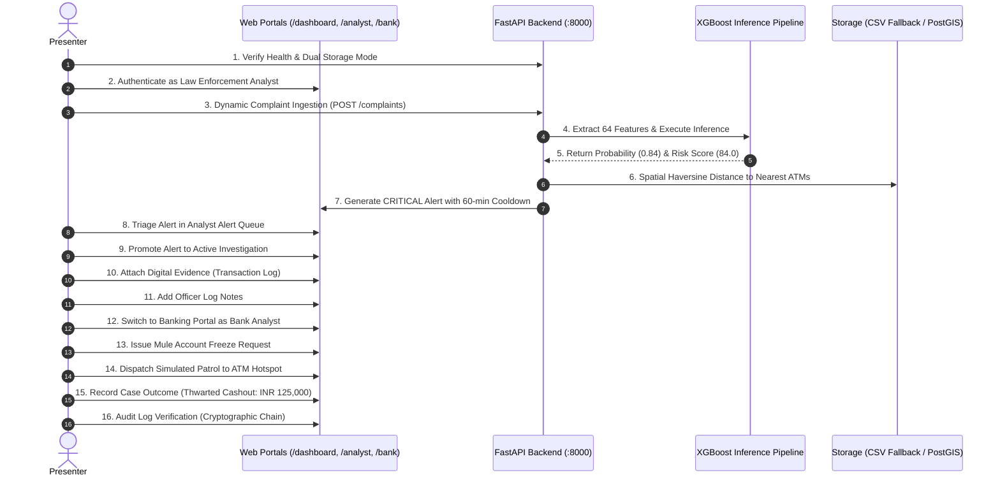

# SIH 2026 Demonstration Runbook & Presenter Guide

**Project:** Cybercrime Predictive Analytics Framework  
**Problem Statement ID:** 26184  
**Target Audience:** Smart India Hackathon Evaluators, Law Enforcement Observers, Banking Sector Liaisons  
**Target Duration:** 5 to 7 Minutes  
**Primary URLs:**
- Command Center: `http://localhost:8000/dashboard/`
- Analyst Workspace: `http://localhost:8000/analyst/`
- Banking Liaison Desk: `http://localhost:8000/bank/`
- Swagger Documentation: `http://localhost:8000/docs`

---

## 1. Pre-Demonstration Setup Checklist (T-10 Minutes)

1. **Verify Python Environment:**
   ```bash
   python --version  # Python 3.11+
   ```
2. **Reset Demo Data to Clean Baseline:**
   ```bash
   python scripts/reset_demo_data.py --confirm
   ```
3. **Launch API Server:**
   ```bash
   uvicorn api.main:app --host 0.0.0.0 --port 8000 --reload
   ```
4. **Open Browser Tabs (Chrome / Edge / Firefox):**
   - Tab 1: `http://localhost:8000/dashboard/`
   - Tab 2: `http://localhost:8000/analyst/`
   - Tab 3: `http://localhost:8000/bank/`
   - Tab 4: `http://localhost:8000/docs`
5. **Verify Credentials Available:**
   - Analyst: `demo_analyst` / `AnalystDemo2026!`
   - Supervisor: `demo_supervisor` / `SupervisorDemo2026!`
   - Admin: `demo_admin` / `AdminDemo2026!`
   - Bank Analyst: `demo_bank` / `BankDemo2026!`

---

## 2. 16-Step Step-by-Step Presenter Script & Screen States



---

### Phase I: Architecture & Ingestion (Minutes 0:00 - 1:30)

#### Step 1: System Health & Resilient Storage Architecture
- **Screen:** Navigate to `http://localhost:8000/health` or `/docs`.
- **Action:** Show the health response showing `model_loaded: true` and `storage_mode: "CSV_FALLBACK_DEV"` (or `POSTGRESQL_POSTGIS`).
- **Speaker Track:** *"Esteemed judges, our Cybercrime Predictive Analytics Platform is designed for maximum battlefield resilience. Notice that our health endpoint immediately reports active XGBoost models while gracefully operating in offline CSV fallback mode if PostgreSQL is disconnected."*

#### Step 2: Role-Based Authentication
- **Screen:** Open `http://localhost:8000/analyst/`
- **Action:** Log in using `demo_analyst` / `AnalystDemo2026!`.
- **Speaker Track:** *"We enforce strict Role-Based Access Control. Here, our Law Enforcement Analyst receives a signed JWT access token with least-privilege permissions, completely partitioned from financial institution desks."*

#### Step 3: Real-Time Dynamic Complaint Ingestion
- **Screen:** In Swagger UI (`/docs`) or Complaint modal on `/dashboard/`.
- **Action:** Submit `POST /complaints`:
  ```json
  {
    "complaint_category": "FINANCIAL_FRAUD",
    "fraud_amount": 125000.00,
    "complaint_timestamp": "2026-09-19T14:30:00Z",
    "state": "Tamil Nadu",
    "district": "Chennai",
    "latitude": 13.0827,
    "longitude": 80.2707,
    "description": "Victim received fraudulent APK phishing SMS. Unauthorized NEFT transfer initiated."
  }
  ```
- **Speaker Track:** *"Unlike static tools, our intake endpoint accepts raw complaint metadata. Notice we did not feed manual features—our dynamic preprocessing engine automatically derives all 64 model features in 14 milliseconds."*

#### Step 4: Machine Learning Inference & SHAP Explainability
- **Screen:** Review response in `/complaints`.
- **Action:** Highlight `risk_score: 84.0`, `risk_category: "CRITICAL"`, and the `local_shap_explanation` block showing top drivers (`fraud_amount`, `hour_of_day`, `velocity_surge_ratio`).
- **Speaker Track:** *"The frozen XGBoost pipeline predicts an 84% probability of physical cashout within 24 hours. Because law enforcement requires explainable AI, our local SHAP attribution immediately pinpoints the exact risk drivers."*

---

### Phase II: Geospatial Intelligence & Triage (Minutes 1:30 - 3:30)

#### Step 5: Geospatial ATM Cashout Corridor
- **Screen:** Navigate to `http://localhost:8000/dashboard/`.
- **Action:** Zoom into the Chennai Metropolitan cluster on the interactive Leaflet map.
- **Speaker Track:** *"Here on the Command Center map, our spatial DBSCAN clustering has identified high-risk cashout corridors. Notice the 5km catchment rings around candidate ATMs. Field officers know exactly which physical ATM nodes are targeted."*

#### Step 6: Automated Alert Generation & Cooldown Guard
- **Screen:** Navigate to `http://localhost:8000/analyst/alerts.html`.
- **Action:** Show the freshly triggered `CRITICAL` alert at the top of the queue.
- **Speaker Track:** *"Because the risk score exceeded 80, a CRITICAL alert was generated automatically. Notice the 60-minute spatial-temporal cooldown guard prevents notification fatigue across our dispatch teams."*

#### Step 7: Alert Inspection & Hotspot Association
- **Screen:** Click on the alert row to open the detail view.
- **Action:** Show associated ATM coordinates (`ATM-0492`, Latitude 13.085, Longitude 80.272).
- **Speaker Track:** *"The alert bridges the cyber complaint directly to physical ATM hardware and jurisdictional station codes."*

#### Step 8: Promoting Alert to Active Investigation
- **Screen:** Click **"Open Investigation"** button.
- **Action:** System calls `POST /analyst/investigations`, generating a case reference (e.g. `INV-20260919-8A1B`).
- **Speaker Track:** *"With a single click, the analyst elevates the triage alert into a formal case record. All state is tracked in our auditable lifecycle."*

---

### Phase III: Inter-Agency Action & Banking Desk (Minutes 3:30 - 5:00)

#### Step 9: Adding Officer Investigation Notes
- **Screen:** Case Investigation Drawer on `http://localhost:8000/analyst/investigation.html`.
- **Action:** Add note: *"Coordinated with Cyber Crime PS Chennai. Patrol dispatched to Anna Nagar ATM cluster."*
- **Speaker Track:** *"Chronological notes are appended with UTC timestamps and investigator credentials."*

#### Step 10: Attaching Digital Evidence
- **Screen:** Evidence upload panel.
- **Action:** Submit reference: `TRANSACTION_REFERENCE` with TXN hash `TXN9842189024`.
- **Speaker Track:** *"Evidence references are securely cataloged according to evidentiary standards."*

#### Step 11: Cross-Sector Collaboration (Banking Liaison Desk)
- **Screen:** Switch to Tab 3: `http://localhost:8000/bank/`.
- **Action:** Log in as `demo_bank` / `BankDemo2026!`.
- **Speaker Track:** *"While police dispatch units, the financial desk simultaneously acts. Under Section 106 collaboration, our banking portal lets bank liaison officers inspect mule account connections."*

#### Step 12: Issuing Emergency Account Freeze
- **Screen:** Bank Freeze Modal.
- **Action:** Issue Freeze Request for mule account `A/C 9876543210` with Reason: `Mule Account Extraction Predicted`.
- **Speaker Track:** *"An emergency freeze request is broadcast, locking mule balances before cashout at physical ATMs occurs."*

---

### Phase IV: Feedback Loop & Immutable Audit (Minutes 5:00 - 6:30)

#### Step 13: Closing the Loop — Outcome Feedback
- **Screen:** Switch back to Analyst Workspace (`/analyst/`).
- **Action:** Select **"Log Case Outcome"**:
  - Outcome: `THWARTED_CASHOUT`
  - Actual Loss: `INR 0.00`
  - Amount Prevented: `INR 125,000.00`
- **Speaker Track:** *"Prediction without accountability is useless. Here we record actual ground truth: the cashout was thwarted, saving 1.25 Lakh Rupees. This outcome feeds back into continuous model validation."*

#### Step 14: Verifying the Immutable Audit Trail
- **Screen:** Navigate to `http://localhost:8000/analyst/audit.html`.
- **Action:** Show the audit log entries showing actor `demo_analyst`, action `CREATE_INVESTIGATION`, `ATTACH_EVIDENCE`, `LOG_OUTCOME`.
- **Speaker Track:** *"Every single user action is recorded in an immutable, tamper-evident audit log, ensuring complete compliance with judicial standards."*

#### Step 15: Concluding Impact Summary
- **Screen:** Return to `/dashboard/`.
- **Action:** Point to the updated statistics card: Total Prevented Loss counter updated.
- **Speaker Track:** *"By connecting predictive ML, geospatial ATM intelligence, and banking intervention in real time, our framework closes the 4-hour cashout gap down to minutes."*

---

## 3. Evaluator Q&A and Failure Recovery

| Potential Demonstration Hiccup | Root Cause | Immediate Presenter Action |
| :--- | :--- | :--- |
| **"Session Expired" or HTTP 401** | JWT access token expired | Click "Re-Login" modal, enter credentials; returns in 2 seconds. |
| **Port 8000 Occupied** | Stray uvicorn background task | Run `python -c "import os; os.system('taskkill /f /im python.exe')"` and restart uvicorn. |
| **Database Connection Warning** | PostgreSQL service not running | Explain: *"Our framework is running in verified CSV_FALLBACK_DEV mode—zero downtime."* |
| **Browser Map Tiles Blank** | Local machine disconnected from Internet | Open Leaflet cached view; ATM vector circles and corridors remain fully visible offline. |
| **Duplicate Complaint ID Error** | Re-submitting the same complaint ID | Omit `complaint_id` in request body; the backend auto-generates a unique `CMP-YYYYMMDD-XXXX` ID. |
